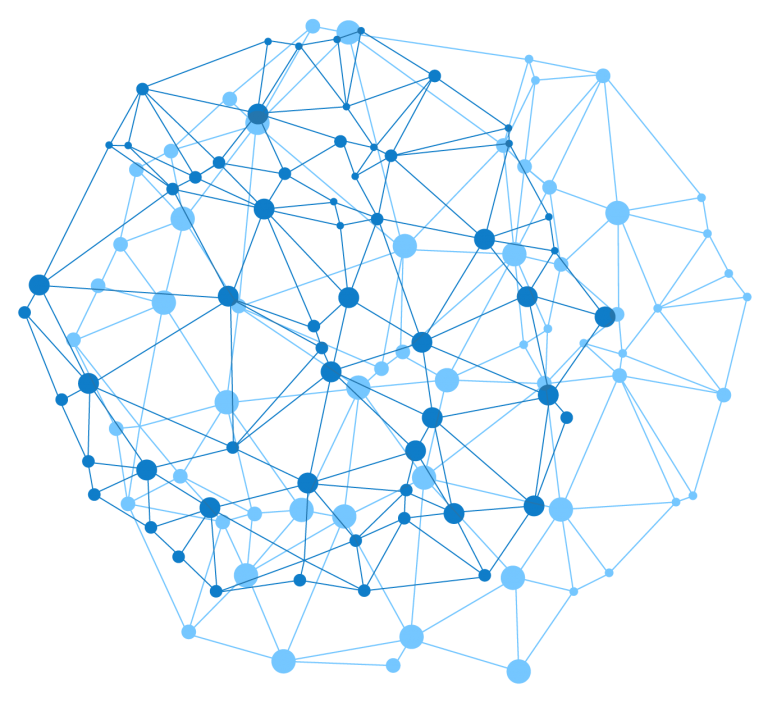

    

# Алгоритмы и тестовые задания

Проект включает в себя мою базу подготовки по алгоритмам и различные решенные тестовые задания IT компаний.

## Структура проекта

| folder             | Description                                                        |
|--------------------|--------------------------------------------------------------------|
| `./demo`           | шаблоны кода с вводом и выводом для платформы **Яндекс.Контекст**  |
| `./interview_task` | тестовые задания на технических интервью                           |
| `./leetcode`       | алгоритмы с одноименной платформы                                  |
| `./practikum`      | решенные алгоритмы в рамках курса на платформе **Яндекс.Контекст** |
| `./ya_algoritm`    | алгоритмы для подготовки на стажировку в Яндекс                    |

## Изученные алгоритмы

## В процессе изучения

    
     algorithms © 2022, created by remph ツ 

