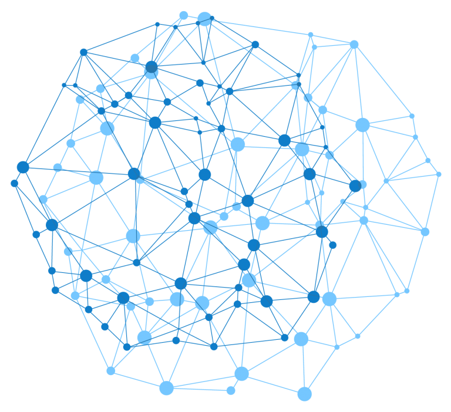

    

## Algorithms and Design Patterns

*Python implementation of data structures, algorithms and design patterns. Also see [awesome-algorithms](https://github.com/tayllan/awesome-algorithms).*

* Algorithms
    * [algorithms](https://github.com/keon/algorithms) - Minimal examples of data structures and algorithms.
    * [python-ds](https://github.com/prabhupant/python-ds) - A collection of data structure and algorithms for coding interviews.
    * [sortedcontainers](https://github.com/grantjenks/python-sortedcontainers) - Fast and pure-Python implementation of sorted collections.
    * [thealgorithms](https://github.com/TheAlgorithms/Python) - All Algorithms implemented in Python.
* Design Patterns
    * [pypattyrn](https://github.com/tylerlaberge/PyPattyrn) - A simple yet effective library for implementing common design patterns.
    * [python-patterns](https://github.com/faif/python-patterns) - A collection of design patterns in Python.
    * [transitions](https://github.com/pytransitions/transitions) - A lightweight, object-oriented finite state machine implementation.

# Алгоритмы и тестовые задания

Проект включает в себя мою базу подготовки по алгоритмам и различные решенные тестовые задания IT компаний.

## Структура проекта

| folder             | Description                                                        |
|--------------------|--------------------------------------------------------------------|
| `./demo`           | шаблоны кода с вводом и выводом для платформы **Яндекс.Контекст**  |
| `./interview_task` | тестовые задания на технических интервью                           |
| `./leetcode`       | алгоритмы с одноименной платформы                                  |
| `./practikum`      | решенные алгоритмы в рамках курса на платформе **Яндекс.Контекст** |
| `./ya_algoritm`    | алгоритмы для подготовки на стажировку в Яндекс                    |

## Изученные алгоритмы и связанные темы

Пространственная и временная сложность алгоритма. Сложность вставки и удаления в динамические массивы. Релокация в динамических массивах

- Метод скользящего среднего
- 2-SUM (TwoSum, метод двух указателей)
- Линейный поиск
- Бинарный поиск
- Решето эратосфена
- Линейное решето
- Рекурсия
- Бинарный поиск с помощью рекурсии
- Рекурсивняй перебор
- Сортировка вставками
- Сортировка по ключу
- Сортировка сравнением
- Сортировка слиянием
- Бвстрая сортировка (quick sort)
- Сортировка подсчетом

## Структуры данных
- Связанные списки
- Стек
- очередь и дек
- бинарное дерево

## В процессе изучения
- хеш-функции
- деревья, обход дерева, двоичные деревья поиска
- сбалансированность дерева поиска
- балансировка АВЛ-дерева
- приоритетная сортировка
- куча. Пирамидальные сортировки

    
     algorithms © 2024, created by remph ツ 

